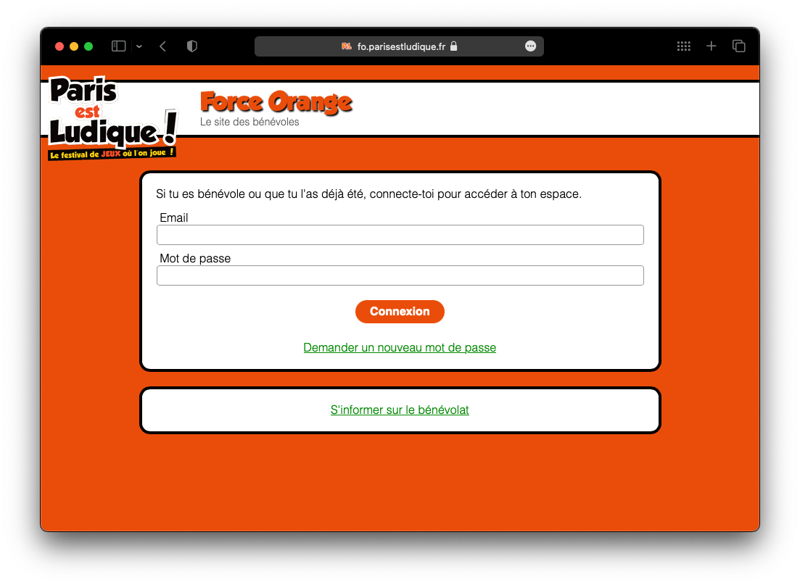

# _Paris est Ludique!_'s Intranet

This project host the source code for Force Orange, the intranet used by the volunteers of the french assocication Paris est Ludique!
It is built from the boilerplate [React Cool Starter](https://github.com/wellyshen/react-cool-starter), on top of [React](https://facebook.github.io/react), [Redux](https://github.com/reactjs/redux), [React Router](https://reacttraining.com/react-router), [Express](https://expressjs.com), [Yarn](https://yarnpkg.com/), [webpack](https://webpack.js.org/) and [Babel](https://babeljs.io/).



## Contributing

### Onboarding

This project is open to contribution, but you will likely need to be in touch with us in order to collaborate efficiently. Contact Paris Est Ludique via our official Website then join the Discord. You will need to get:

-   Access to a database sample to place in `./access/dbToLoad.json`
-   Access to our [Trello Issue trackerd](https://trello.com/b/5oKGdc1K/intranet-pel-2022)

### Requirements

-   An account on GitHub
-   [git](https://git-scm.com/)
-   [node](https://nodejs.org/en) >= 12.0
-   [npm](https://www.npmjs.com) >= 6.0
-   On MacOS, [HomeBrew](https://brew.sh/) is recommanded
-   An IDE of your choice. We suggests:
    -   [Atom](https://atom.io/) with [TypeScript plugin](https://atom.io/packages/ide-typescript)
    -   [Visual Studio Code](https://code.visualstudio.com/)
    -   [Webstorm 2018.1](https://www.jetbrains.com/webstorm/download/)
    -   [Sublime Text](http://www.sublimetext.com/3) with [Typescript-Sublime-Plugin](https://github.com/Microsoft/Typescript-Sublime-plugin#installation)

### Setup

Using a terminal:

```bash
# Clone this repository on your computer
git clone https://github.com/forceoranj/intranet.git
cd intranet

# Install dependencies using YARN
npm install --legacy-peer-deps
brew install corepack # If not included in your npm
corepack enable
yarn

# Include the database
mv ~/Downloads/database-sample.json ./access/dbToLoad.json

# Start your local server
yarn dev  # Build, hosts, and hot reload saved modifications
```

Now the app should be serving at <http://localhost:3000>.

### Contribution rules

We stick to the [GitHub Flow workflow](https://docs.github.com/en/get-started/quickstart/github-flow)

-   Commiting to the main branch is forbidden. Make use of topic branches to change code.
-   PR names should follow the [Conventional Commit](https://www.conventionalcommits.org/en/v1.0.0/#summary) (`fix(#x)`, `feat(#y)`, `refactor(#z)`, …)
-   PR should relate to an issue on our Issue Tracker, either our [Trello board](https://trello.com/b/5oKGdc1K/intranet-pel-2022) or this project one.
-   You can fork the repository on your space and PR from there, but this is not mandatory.

## Contributors ✨

Thanks goes to these people ([emoji key](https://allcontributors.org/docs/en/emoji-key)):

<!-- ALL-CONTRIBUTORS-LIST:START - Do not remove or modify this section -->
<!-- prettier-ignore-start -->
<!-- markdownlint-disable -->
<table>
  <tr>
    <td align="center"><a href="https://www.parisestludique.fr"><br /><sub><b>pikiou</b></sub></a><br /><a href="https://github.com/forceoranj/intranet/commits?author=pikiou" title="Code">💻</a> <a href="https://github.com/forceoranj/intranet/commits?author=pikiou" title="Documentation">📖</a> <a href="#maintenance-forceoranj" title="Maintenance">🚧</a></td>
  </tr>
</table>

<!-- markdownlint-enable -->
<!-- prettier-ignore-end -->

<!-- ALL-CONTRIBUTORS-LIST:END -->

This project follows the [all-contributors](https://github.com/all-contributors/all-contributors) specification. Contributions of any kind welcome!
